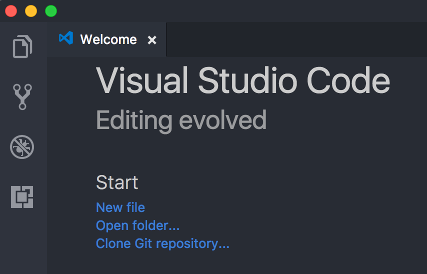
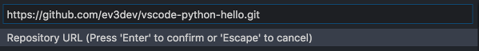
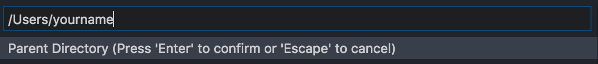
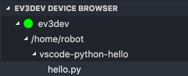
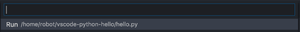

# vscode-python-hello
Hello World for [ev3dev] + [Visual Studio Code][code] + [Python]

## Overview
This is a git repository to help you get started programming a robot using
ev3dev in Visual Studio Code using the Python programming language.

## Prerequisites
* LEGO MINDSTORMS EV3, Dexter Industries Brick Pi, Mindsensors PiStorms, or
  FatcatLab EVB with [ev3dev] installed.
* A computer (Windows, macOS, or Linux) with [Visual Studio Code][code] and
  [git] or [GitHub Desktop][github] installed.

## Step-by-Step
1.  Start Visual Studio Code.

2.  Select *Clone Git repository...* in the *Welcome* tab.

    
3.  Enter `https://github.com/ev3dev/vscode-python-hello.git` as the repository
    name and press <kbd>Enter</kbd>.

    

4.  Enter the name of the directory where you would like to clone (download)
    this repository. This can be any place you like to save files.

    

5. Click *Open Repository* when asked.

    

6.  Click *Show Recommendations* when asked.

    

7.  Install the `ev3dev-browser` extension. If you have Python installed on your
    computer, you can install that extension too. (Don't install it if you don't
    have Python already installed.)

    

8.  After installation completes, click *Reload* and *Reload Window*.

    

    

9. Open the *Explorer* activity pane.

    

10. Click the arrow next to *EV3DEV DEVICE BROWSER* to open it.

    

    

11. Ensure that your ev3dev device is turned on and has a network connection to
    the host computer. USB, Bluetooth, Wi-Fi or wired will work.

12. Click the *+* icon to browse for your device and then select it from the
    list.

    

13. Once the device has connected, you will see a green dot and the
    `/home/robot` folder.

    

14. Click the *Download* button (next to the *+* button) to send the `hello.py`
    file to the device.

15. Expand the folders to find `hello.py` and click it.

    

16. Click *Run* (or press <kbd>Enter</kbd>) to run the program.

    

17. The *Output* pane will automatically open and show the status of the
    program and any error/debug messages.

    

18. Open the source code file, `hello.py`, to learn more.

## TODO

* Explain how to get code completion working
* Explain how to install ev3dev-lang-python on the host computer

[ev3dev]: http://www.ev3dev.org
[code]: https://code.visualstudio.com/
[python]: https://www.python.org/
[git]: https://git-scm.com/
[github]: https://desktop.github.com/
